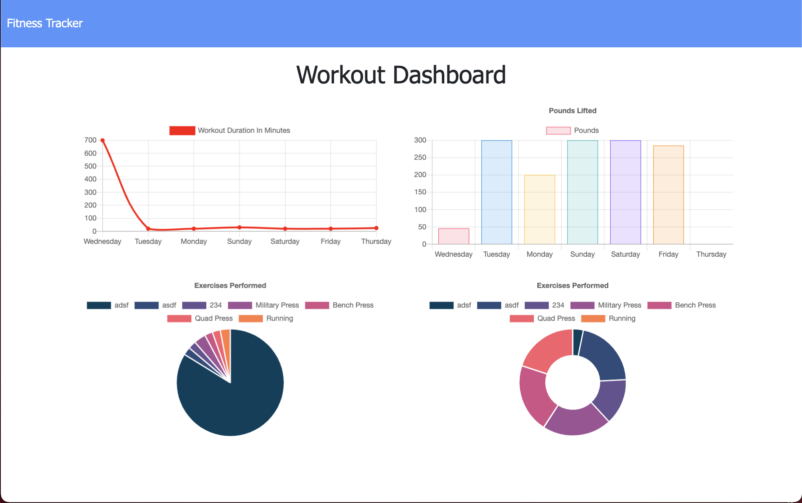

# Workout Tracker  
  ## Table of Content
  * [Description](##Description)
  * [Installation Instructions](##Installation-Instructions)
  * [Usage Instructions](##Usage-Information)
  * [Contribution Guidelines](##Contribution-Guidelines)
  * [Test Instructions](##Test-Instructions)
  * [Questions](##Questions)
  
  ## Screenshots of the Application

  ## Description
  This is an application that allows you to add and store your workouts.  The application also has a dashboard that allows you to see the past 7 workouts that you have done.

  ## Installation Instructions
  This project is deployed on Heroku.

  ## Usage Information
  Open the app [here](https://workout-tracker-05071.herokuapp.com/?id=6024caa86de7000015d91777). You can click on Dashboard for the previous workouts.  You can also continue adding exercises to the last workout or adding a new workout for that day. 

  ## Contribution Guidelines
  Contributions to this project should be according to . 

  ## Test Instructions
  To test the project, enter in a workout and see the result.  

  ## License
  This project and the application(s) hereinto is(are) covered under the MIT License.  
  
  ## Questions
  For any questions about this project, please first visit my Github repo [here](https://github.com/alzcheng). 
  If the answers are not found in my repo, you can email me directly at <albertzcheng@gmail.com>.
